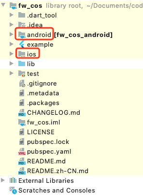
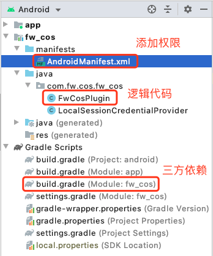

记flutter插件开发实践过程。官方中文文档：https://flutterchina.club/developing-packages/，官方文档：https://flutter.dev/docs/development/packages-and-plugins/developing-packages
<!-- more -->

### 一、新建插件
官方提供了两种新建插件的方法
+ 1.IDE里 file -> new -> new flutter project -> flutter plugin -> next(输入信息) -> finish
+ 2.通过命令行新建，flutter create --org com.xxx.xxx --template=plugin --platforms=android,ios -a java -i objc <plugin name>
 - 实践发现，通过IDE里新建的plugin，没有android和ios目录，所以这里采用的是第二种方法。
 - 新建完成后的目录如下，新建完成后可以cd到example/lib/main.dart，然后run，确认能正常运行，不会报错。
   
** 新建插件的时候，可以选择android和ios的开发语言，本示例中仅支持java和object-c，不支持kotin和swift.

### 二、添加功能
1、找到 lib/xxxx.dart
2、仿照项目给的默认方法 platformVersion ，新增自己的方法

### 三、android端功能新增
1、在android目录上右键，选择flutter，然后open android module in android studio。
2、接下来会以安卓项目打开android下面的目录（直接在插件项目里编辑安卓原生代码会报很多错误，并且没有自动补全提示）
3、添加自己的代码逻辑（这里涉及到安卓原生开发）
    + manifests/AndroidManifest.xml里面添加权限（如果有需要）
    + java/com.xxx.xxx/xxxPlugin里面添加逻辑代码
    + Gradle Scripts/build.gradle里添加第三方依赖（如果有，具体可以参照第三方文档）
4、完成后点击操作栏的额 make project（绿色的🔨），等待构建完成
5、回到插件项目，在example/lib/main.dart里加上测试代码，看功能是否ok

### 四、ios端功能新增
1、在ios目录上右键，选择flutter，然后open ios module in xcode。
2、接下来会以ios项目打开ios下面的目录
3、添加自己的代码逻辑（这里涉及到ios原生开发）
    + Pods/Development Pods/<plugin name>/Pod/xxx.podspec里面添加依赖（如果有需要）
    + Pods/Development Pods/<plugin name>/....../Classes/xxx.m里面添加逻辑代码
4、回到插件项目，在example/lib/main.dart里加上测试代码，看功能是否ok

### 五、发布到pub.dev
1、确保pubspec.yaml、README.md、CHANGELOG.md、LICENSE都正确填写，然后执行下面命令检查是否有错误。
```bash
flutter packages pub publish --dry-run
```
2、检查无误后，执行下面命令发布。
```bash
flutter packages pub publish
```

** 发布过程中，可能遇到一直卡在 Authorization received, processing... ，解决方案如下：
   + 首先打开shadow sockets，然后在terminal里开启代理：
   ```bash
   export http_proxy=http://127.0.0.1:1087;
   export https_proxy=http://127.0.0.1:1087;
   ```
   + 如果开了代理还是不行，可以试试将地址指向官方的。
   ```bash
   flutter packages pub publish --server=https://pub.dartlang.org
   ```

#### 参考网站
    <https://edu.csdn.net/course/play/23392/265119>
    <https://www.jianshu.com/p/46957915a909>
    <https://www.jianshu.com/p/5f1d65465bca>
    <https://www.jianshu.com/p/4bf045fd21f5>
    <https://blog.csdn.net/youtiankeng/article/details/107825986>